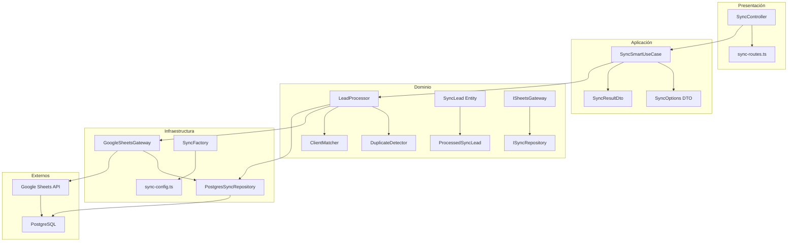

# Arquitectura del Sistema de Sincronización

## Estado Actual
**✅ ARQUITECTURA ESTABLE - Septiembre 4, 2025**

Sistema basado en **Clean Architecture** con separación clara de responsabilidades entre dominio, aplicación, infraestructura y presentación.

## Vista General



## Capas de la Arquitectura

### 1. Capa de Presentación (`presentation/`)

#### SyncController
**Responsabilidad**: Orquestar las solicitudes HTTP y gestionar respuestas.

```typescript
class SyncController {
  // Endpoint principal de sincronización inteligente
  async smartSync(req: Request, res: Response)
  
  // Endpoint de estado del sistema
  async getStatus(req: Request, res: Response)
  
  // Endpoint de hojas disponibles
  async getAvailableSheets(req: Request, res: Response)
}
```

**Funciones Clave**:
- ✅ Validación de parámetros de entrada
- ✅ Manejo de errores HTTP
- ✅ Transformación de DTOs
- ✅ Logging de requests

#### sync-routes.ts
**Responsabilidad**: Definir rutas y middleware.

```typescript
router.post('/smart', syncController.smartSync);
router.get('/status', syncController.getStatus);  
router.get('/sheets/available', syncController.getAvailableSheets);
```

### 2. Capa de Aplicación (`application/`)

#### SyncSmartUseCase
**Responsabilidad**: Lógica de negocio de sincronización inteligente.

```typescript
class SyncSmartUseCase {
  async execute(options: SyncOptions): Promise<SyncResultDto> {
    // 1. Obtener hojas disponibles
    // 2. Analizar estado por marca
    // 3. Determinar estrategia de sincronización
    // 4. Procesar leads por marca
    // 5. Generar resultado detallado
  }
}
```

**Funciones Clave**:
- ✅ **Análisis por marca**: Determina qué datos sincronizar
- ✅ **Estrategia inteligente**: Full sync vs incremental
- ✅ **Procesamiento paralelo**: Múltiples marcas simultáneamente
- ✅ **Control de estado**: Seguimiento en tiempo real

#### DTOs

##### SyncOptions
```typescript
interface SyncOptions {
  sheets?: string[];           // Marcas específicas a sincronizar
  forceFullSync?: boolean;     // Forzar sincronización completa
  includeDashboard?: boolean;  // Actualizar dashboard después
  includeMetrics?: boolean;    // Actualizar métricas después  
  validateData?: boolean;      // Validar datos (default: true)
  dryRun?: boolean;           // Modo prueba sin guardar
  verbose?: boolean;          // Logs detallados
}
```

##### SyncResultDto
```typescript
interface SyncResultDto {
  success: boolean;
  message: string;
  leadsProcessed: number;
  timestamp: string;
  duration: number;
  durationFormatted: string;
  details: {
    newLeads: number;
    updatedLeads: number;
    skippedLeads: number;
    duplicatesFound: number;
    validationErrors: number;
    sheetsProcessed: string[];
  }
}
```

### 3. Capa de Dominio (`domain/`)

#### Entidades

##### SyncLead
**Responsabilidad**: Representar un lead con toda su información de dominio.

```typescript
interface SyncLead {
  // Identificación
  metaLeadId: string;
  
  // Datos principales
  nombre: string;
  telefono: string;
  email: string;
  
  // Datos adicionales (pueden ser NULL)
  ciudad: string | null;
  modelo: string | null;
  comentarioHorario: string | null;
  
  // Metadatos
  marca: string;
  origen: string | null;
  localizacion: string | null;
  cliente: string | null;
  
  // Control
  googleSheetsRowNumber?: number;
  fechaCreacion: string;
  source: 'google_sheets' | 'meta_ads' | 'manual';
  campaign: string;
}
```

##### ProcessedSyncLead
**Responsabilidad**: Lead procesado listo para almacenamiento.

```typescript
interface ProcessedSyncLead extends SyncLead {
  // Campos normalizados
  normalizedPhone: string;
  normalizedEmail: string;
  normalizedClient: string;
  
  // Estado de procesamiento
  isValid: boolean;
  validationErrors: string[];
  isDuplicate: boolean;
  duplicateOf?: string;
}
```

#### Servicios de Dominio

##### LeadProcessor
**Responsabilidad**: Procesar y validar leads según reglas de negocio.

```typescript
class LeadProcessor {
  // Convierte RawSheetLead → SyncLead
  convertRawLead(rawLead: RawSheetLead): SyncLead
  
  // Normaliza campos según reglas de negocio
  normalizeFields(lead: SyncLead): ProcessedSyncLead
  
  // Valida integridad de datos
  validateLead(lead: SyncLead): ValidationResult
}
```

**Reglas de Negocio**:
- ✅ **Campos requeridos**: nombre, telefono usan 'S/D' si vacío
- ✅ **Campos opcionales**: usan NULL si vacío
- ✅ **Normalización**: teléfonos, emails, nombres de cliente
- ✅ **Validación**: criterios mínimos de calidad

##### DuplicateDetector
**Responsabilidad**: Detectar duplicados usando múltiples criterios.

```typescript
class DuplicateDetector {
  // Detecta duplicados por teléfono normalizado
  detectByPhone(leads: SyncLead[]): DuplicateResult[]
  
  // Detecta duplicados por MetaLeadId
  detectByMetaId(leads: SyncLead[]): DuplicateResult[]
  
  // Detecta duplicados por número de fila de Google Sheets
  detectByRowNumber(leads: SyncLead[]): DuplicateResult[]
  
  // Combina todos los criterios
  detectAllDuplicates(leads: SyncLead[]): DuplicateResult[]
}
```

**Criterios de Detección**:
1. **Teléfono normalizado**: Elimina espacios, guiones, paréntesis
2. **MetaLeadId**: Identificador único de Meta Ads
3. **Número de fila + marca**: `CHEVROLET_411`

##### ClientMatcher
**Responsabilidad**: Hacer matching entre nombres de cliente y clientes normalizados.

```typescript
class ClientMatcher {
  // Normaliza nombre de cliente
  normalizeClientName(clientName: string): string
  
  // Encuentra cliente más similar
  findBestMatch(clientName: string, existingClients: string[]): MatchResult
}
```

#### Interfaces de Dominio

##### ISheetsGateway
```typescript
interface ISheetsGateway {
  getAllLeads(): Promise<RawSheetLead[]>;
  getLeadsFromSheet(sheetName: string): Promise<RawSheetLead[]>;
  getLeadsFromSheets(sheetNames: string[]): Promise<RawSheetLead[]>;
  getAvailableSheetNames(): Promise<string[]>;
  validateSheetAccess(): Promise<boolean>;
  getLastModified(sheetName?: string): Promise<Date | null>;
}
```

##### ISyncRepository
```typescript
interface ISyncRepository {
  saveLeads(leads: ProcessedSyncLead[]): Promise<SaveResult>;
  getExistingLeads(marca: string): Promise<SyncLead[]>;
  getLastProcessedRow(marca: string): Promise<number | null>;
  countLeadsByMarca(marca: string): Promise<number>;
  findDuplicates(criteria: DuplicateCriteria): Promise<SyncLead[]>;
  cleanupDuplicates(marca: string): Promise<CleanupResult>;
}
```

### 4. Capa de Infraestructura (`infrastructure/`)

#### GoogleSheetsGateway
**Responsabilidad**: Implementación concreta del acceso a Google Sheets.

```typescript
class GoogleSheetsGateway implements ISheetsGateway {
  // Configuración de autenticación
  private initializeAuth()
  
  // Obtener datos de sheets específicos
  async getLeadsFromSheet(sheetName: string): Promise<RawSheetLead[]>
  
  // Mapeo de filas a entidades
  private parseRowToRawSheetLead(row: any[], sheetName: string): RawSheetLead | null
  
  // Validación de filas
  private isValidRow(row: any[]): boolean
}
```

**Características Técnicas**:
- ✅ **Autenticación API Key**: Google Sheets API v4
- ✅ **Validación permisiva**: Acepta filas con contenido mínimo
- ✅ **Mapeo con NULL**: Campos vacíos → NULL en lugar de strings vacíos
- ✅ **Manejo de errores**: Retry logic con backoff exponencial
- ✅ **Rate limiting**: Respeta límites de Google Sheets API

#### PostgresSyncRepository
**Responsabilidad**: Implementación concreta del acceso a PostgreSQL.

```typescript
class PostgresSyncRepository implements ISyncRepository {
  // Operaciones de persistencia
  async saveLeads(leads: ProcessedSyncLead[]): Promise<SaveResult>
  
  // Consultas optimizadas
  async getExistingLeads(marca: string): Promise<SyncLead[]>
  
  // Análisis de estado
  async analyzeBrandStatus(marca: string): Promise<BrandStatus>
  
  // Limpieza de duplicados
  async cleanupDuplicates(marca: string): Promise<CleanupResult>
}
```

**Optimizaciones**:
- ✅ **Consultas por lotes**: Batch insert/update
- ✅ **Índices optimizados**: Por marca, teléfono, fila
- ✅ **Transacciones**: Garantía de consistencia
- ✅ **Cache de estado**: Reduce consultas repetitivas

#### SyncFactory
**Responsabilidad**: Instanciar y configurar todos los componentes.

```typescript
class SyncFactory {
  createSyncUseCase(): SyncSmartUseCase
  createSheetsGateway(): ISheetsGateway  
  createSyncRepository(): ISyncRepository
  createLeadProcessor(): LeadProcessor
}
```

## Flujo de Datos

### 1. Flujo Principal de Sincronización

```
1. HTTP Request → SyncController
2. SyncController → SyncSmartUseCase
3. SyncSmartUseCase → GoogleSheetsGateway (obtener datos)
4. GoogleSheetsGateway → Google Sheets API
5. Google Sheets API → Raw Data
6. SyncSmartUseCase → LeadProcessor (procesar datos)
7. LeadProcessor → DuplicateDetector (detectar duplicados)
8. SyncSmartUseCase → PostgresSyncRepository (guardar)
9. PostgresSyncRepository → PostgreSQL
10. SyncSmartUseCase → SyncResultDto
11. SyncController → HTTP Response
```

### 2. Flujo de Procesamiento de Lead

```
RawSheetLead → LeadProcessor.convertRawLead() → SyncLead
SyncLead → LeadProcessor.normalizeFields() → ProcessedSyncLead  
ProcessedSyncLead → DuplicateDetector.detectAllDuplicates() → ValidatedLead
ValidatedLead → PostgresSyncRepository.saveLeads() → Database
```

### 3. Flujo de Detección de Duplicados

```
Leads Array → DuplicateDetector
  ├─ detectByPhone() → Phone matches
  ├─ detectByMetaId() → Meta ID matches  
  └─ detectByRowNumber() → Row matches
Combined Results → Unique leads + Duplicates
```

## Patrones de Diseño Utilizados

### 1. Repository Pattern
- **ISyncRepository** → Abstrae acceso a datos
- **PostgresSyncRepository** → Implementación concreta
- **Ventajas**: Testeable, intercambiable, separación de concerns

### 2. Gateway Pattern  
- **ISheetsGateway** → Abstrae API externa
- **GoogleSheetsGateway** → Implementación concreta
- **Ventajas**: Mockeable, resiliente, versionable

### 3. Use Case Pattern
- **SyncSmartUseCase** → Orquesta lógica de negocio
- **Ventajas**: Testeable, reutilizable, clara responsabilidad

### 4. Factory Pattern
- **SyncFactory** → Instancia y conecta componentes
- **Ventajas**: Configuración centralizada, DI simple

### 5. DTO Pattern
- **SyncOptions**, **SyncResultDto** → Transferencia de datos
- **Ventajas**: Tipado fuerte, versionable, serializable

## Principios SOLID Aplicados

### Single Responsibility (SRP) ✅
- **SyncController**: Solo HTTP handling
- **LeadProcessor**: Solo procesamiento de leads
- **DuplicateDetector**: Solo detección de duplicados

### Open/Closed (OCP) ✅  
- **Interfaces**: Extensibles sin modificar código existente
- **Strategy pattern**: Diferentes detectores de duplicados

### Liskov Substitution (LSP) ✅
- **ISheetsGateway**: Cualquier implementación es intercambiable
- **ISyncRepository**: Cualquier BD puede implementarlo

### Interface Segregation (ISP) ✅
- **Interfaces específicas**: No dependen de métodos no usados
- **Responsabilidades claras**: Cada interface tiene propósito único

### Dependency Inversion (DIP) ✅
- **Abstracciones**: Dominio no depende de infraestructura
- **Injection**: Dependencies inyectadas desde factory

## Beneficios de la Arquitectura

### 🧪 Testabilidad
- **Unit tests**: Cada componente testeable independientemente
- **Integration tests**: Interfaces permiten mocks fáciles
- **E2E tests**: Flujo completo testeable

### 🔧 Mantenibilidad
- **Separación clara**: Cambios localizados por responsabilidad
- **Código limpio**: Fácil de leer y entender
- **Documentación**: Interfaces documentan contratos

### 🚀 Escalabilidad
- **Componentes independientes**: Scaling horizontal posible
- **Interfaces**: Cambio de implementaciones sin impacto
- **Performance**: Optimizaciones localizadas

### 🛠️ Extensibilidad
- **Nuevas fuentes**: Fácil agregar nuevos gateways
- **Nuevos detectores**: Plugin de detectores de duplicados  
- **Nuevas validaciones**: Extensión de reglas de negocio

## Configuración y Deployment

### Variables de Entorno
```env
GOOGLE_SHEETS_API_KEY=          # API key para Google Sheets
GOOGLE_SHEETS_SPREADSHEET_ID=   # ID del spreadsheet principal  
DATABASE_URL=                   # Conexión PostgreSQL
NODE_ENV=                       # development/production
```

### Dependencies
```json
{
  "googleapis": "^134.0.0",     // Google Sheets API
  "drizzle-orm": "^0.29.0",     // ORM PostgreSQL  
  "@types/node": "^20.0.0"      // TypeScript support
}
```

### Healthchecks
- **GET /api/sync/status** → Estado del sistema
- **Database connectivity** → PostgreSQL disponible
- **Google Sheets API** → Sheets accesibles

---

**Estado de la Arquitectura: ✅ ESTABLE Y OPERATIVA**  
**Fecha de Última Actualización: Septiembre 4, 2025**  
**Próximos Pasos**: Monitoreo y métricas de performance**